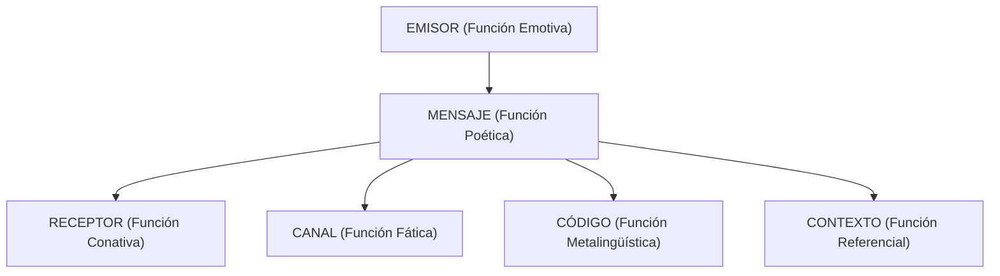

# 📖 Master Dossier de Lengua Castellana: El Comentario de Texto Crítico
**Asignatura:** Lengua Castellana y Literatura I | **Profesora:** Ana Isabel Marín Arellano  
**Objetivo de Examen:** Examen 1 de Comentario Crítico (~5 de Octubre de 2026)  
**Optimizado para:** Google NotebookLM (Generación de Audio Overview / Podcast y Guía de Redacción) y Repaso Móvil  

---

## 🎧 Introducción para la IA / Audio Overview de NotebookLM
> *Este documento es una guía técnica, metodológica y práctica sobre cómo destripar, analizar y comentar un texto argumentativo o periodístico de opinión en 1º de Bachillerato según los criterios LOMLOE y de acceso a la universidad (PAU). Explica la formulación del Tema, la localización de la Tesis, las estructuras textuales, las 6 funciones del lenguaje de Roman Jakobson con sus marcas lingüísticas y el catálogo exhaustivo de tipos de argumentos.*

---

## 🎯 MÓDULO 1: Anatomía de la Prueba de Comentario Crítico

El examen de comentario de texto evalúa tres competencias fundamentales:
1. **Comprensión lectora:** Extraer el sentido profundo del texto, sin quedarse en la anécdota.
2. **Análisis estructural y lingüístico:** Demostrar cómo los recursos del lenguaje sirven a la intención comunicativa del autor.
3. **Producción escrita argumentada:** Redactar con cohesión, riqueza léxica, madurez y corrección ortográfica.

---

## 🔍 MÓDULO 2: El Tema y la Tesis (Diferencia Vital de Examen)

Muchos alumnos suspenden o pierden 1.5 puntos por confundir el **Tema** con el **Resumen** o con la **Tesis**.

| Parámetro | El Tema | La Tesis |
| :--- | :--- | :--- |
| **¿Qué es?** | El asunto global y abstracto del que trata el texto. | La postura, opinión o juicio de valor que defiende el autor. |
| **Forma gramatical** | **Sintagma Nominal SIN verbo en forma personal** (6 a 10 palabras). | **Oración completa con verbo conjugado** (con sujeto y predicado). |
| **Pregunta clave** | *¿De qué habla el texto de forma general?* | *¿Qué postura o idea concreta nos intenta convencer de aceptar?* |
| **Ejemplo correcto** | *"La pérdida de empatía social derivada del uso adictivo de las redes sociales."* | *"El uso excesivo de las redes sociales en adolescentes destruye su capacidad empática y debe regularse educativamente."* |
| **Error típico que resta puntos** | Poner un verbo: *"El autor habla de que las redes sociales son malas..."* ❌ | Repetir el tema sin posicionamiento: *"Las redes sociales."* ❌ |

---

## 📐 MÓDULO 3: Estructuras Textuales Argumentativas

La estructura viene determinada por la **posición de la Tesis** dentro del texto:

1. **Estructura Analizante o Deductiva:**
   * La tesis se formula al **principio** (en el primer o segundo párrafo).
   * El resto del texto aporta argumentos, ejemplos y justificaciones que demuestran la validez de esa tesis inicial.
   * *Esquema:* Tesis ➔ Argumentos ➔ Conclusión.
2. **Estructura Sintetizante o Inductiva:**
   * El texto comienza exponiendo hechos, casos particulares, anécdotas o datos.
   * Tras el análisis de esos datos, al **final** del texto se llega como conclusión a la formulación explícita de la tesis.
   * *Esquema:* Argumentos / Ejemplos ➔ Tesis Final.
3. **Estructura Encuadrada (o Circular):**
   * La tesis aparece al **principio**, se desarrollan argumentos en el cuerpo central, y en el último párrafo se **reafirma o reformula la misma tesis** con nuevas palabras.
   * *Es la estructura más sólida y elegante en artículos de opinión.*
4. **Estructura Paralela:**
   * No hay una tesis dominante sobre las demás; se presentan distintas ideas o vertientes de un mismo problema con igual jerarquía a lo largo del texto.
5. **Estructura Repetitiva:**
   * La misma tesis se va reiterando machaconamente a lo largo de cada párrafo con matices o ejemplos diferentes.

---

## 🎭 MÓDULO 4: Las 6 Funciones del Lenguaje de Roman Jakobson

En un examen de 1º de Bachillerato, **no basta con nombrar la función**: es obligatorio citar entrecomilladas las **marcas lingüísticas concretas** extraídas del texto.

### 1. Función Emotiva o Expresiva (Centrada en el Emisor)
* **Objetivo:** Transmitir emociones, juicios de valor, opiniones subjetivas o estados de ánimo del autor.
* **Marcas lingüísticas obligatorias para citar:**
  * Verbos en 1ª persona del singular o del plural inclusivo: *"creo", "siento", "pensamos"*.
  * Adjetivos y adverbios valorativos / modalizadores: *"desolador", "magnífico", "tristemente", "sorprendentemente"*.
  * Oraciones exclamativas, desiderativas y dubitativas.
  * Sufijos apreciativos (diminutivos, despectivos): *"chiquillada", "pantallita"*.
  * Léxico connotativo cargado ideológica o sentimentalmente.

### 2. Función Conativa o Apelativa (Centrada en el Receptor)
* **Objetivo:** Influir en el lector, llamar su atención, convencerlo, persuadirlo o modificar su conducta.
* **Marcas lingüísticas:**
  * Uso de la 2ª persona: tú / vosotros / usted (*"mira", "recuerda"*).
  * Plural sociativo o inclusivo (hace cómplice al lector): *"debemos reflexionar", "todos sabemos"*.
  * Modo Imperativo y perífrasis verbales de obligación: *"actuad ya", "tenemos que cambiar", "hay que regular"*.
  * Preguntas retóricas (preguntas que no buscan respuesta, sino hacer pensar al lector): *"¿Hasta cuándo vamos a tolerar esta degradación?"*.
  * Vocativos.

### 3. Función Referencial o Representativa (Centrada en el Contexto / Realidad)
* **Objetivo:** Informar objetivamente sobre hechos reales, datos comprobables o situaciones sin emitir juicios.
* **Marcas lingüísticas:**
  * Uso de la 3ª persona gramatical y modo indicativo.
  * Cifras, porcentajes, fechas, nombres propios de instituciones: *"El 67% de los jóvenes...", "El Ministerio publicó..."*.
  * Adjetivos especificativos neutros (no valorativos): *"reforma laboral", "dispositivo electrónico"*.
  * Léxico denotativo y oraciones enunciativas.

### 4. Función Poética o Estética (Centrada en el Mensaje)
* **Objetivo:** Embellecer la forma del mensaje, llamar la atención sobre el propio lenguaje y generar impacto estético.
* **Marcas lingüísticas:**
  * Figuras retóricas: metáforas (*"el veneno digital"*), comparaciones (*"inmóviles como estatuas"*), personificaciones, antítesis, hipérboles.
  * Ironía (decir lo contrario de lo que se piensa con tono sarcástico).
  * Paralelismos sintácticos y juegos de palabras.

### 5. Función Fática o de Contacto (Centrada en el Canal)
* **Objetivo:** Comprobar que el canal comunicativo sigue abierto o mantener la conexión con el interlocutor.
* **Marcas lingüísticas:**
  * Muletillas, marcadores de contacto: *"¿verdad?", "¿no?", "como decíamos", "oiga"*.

### 6. Función Metalingüística (Centrada en el Código)
* **Objetivo:** Utilizar la lengua para reflexionar sobre el propio lenguaje, definir términos o aclarar significados.
* **Marcas lingüísticas:**
  * Explicación de etimologías, entrecomillados para definir una palabra extranjera, uso de comillas para términos técnicos: *"El concepto de 'phishing' se refiere a..."*.

---

## 🛡️ MÓDULO 5: Catálogo Completo de Tipos de Argumentos

Para analizar cómo argumenta el autor (o para redactar tu propio posicionamiento crítico):

| Tipo de Argumento | Definición | Ejemplo Ilustrativo |
| :--- | :--- | :--- |
| **De Autoridad** | Cita o referencia a expertos prestigiosos, filósofos, científicos o instituciones reconocidas. | *"Como advierte la neuróloga Marian Rojas, la dopamina rápida destruye la corteza prefrontal."* |
| **De Datos / Cifras** | Estadísticas, porcentajes o estudios empíricos cuantificables. | *"El informe de la OCDE confirma que el 74% de los estudiantes lee menos que hace una década."* |
| **De Ejemplificación** | Casos concretos, anécdotas reales o situaciones verificables que ilustran la idea general. | *"Casos recientes en institutos riojanos demuestran que prohibir el móvil en clase aumenta la concentración."* |
| **De Analogía / Comparación** | Comparar dos situaciones semejantes para transferir la conclusión de una a la otra. | *"Permitir que un niño acceda a internet sin filtro es tan temerario como dejarlo cruzar una autopista a ciegas."* |
| **De Causa - Efecto** | Establece una conexión causal lógica entre un fenómeno y sus consecuencias. | *"El sedentarismo crónico provoca obesidad y un empeoramiento precoz de la salud cardiovascular."* |
| **De Sentir General / Tópico** | Apela al sentido común colectivo, refranes o verdades asumidas por la sociedad. | *"Nadie desea para sus hijos una sociedad violenta o deshumanizada."* |
| **De Experiencia Personal** | Vivencias directas del propio autor (aporta cercanía, aunque tiene menos rigor científico). | *"En mis veinticinco años como docente he visto la caída progresiva de la capacidad de atención."* |

---

## 📝 MÓDULO 6: Plantilla Estándar para Redactar el Comentario Crítico (10/10)

Cuando el examen te pida: *"Realice un comentario crítico fundamentado sobre las ideas del texto"*:

### Párrafo 1: Introducción y localización de la tesis (3-4 líneas)
> *El texto propuesto, firmado por [Autor] y publicado en [Medio/Fecha], aborda como tema principal [Tema en sintagma nominal]. A través de una estructura argumentativa [Deductiva / Inductiva / Encuadrada], el autor defiende la tesis de que [Tesis formulada en oración completa con verbo].*

### Párrafo 2: Valoración crítica de los argumentos del autor (6-8 líneas)
> *Para sostener su postura, el emisor despliega con solidez diversos recursos dialécticos, entre los que destaca el argumento de autoridad al citar a [Experto], reforzado con datos cuantitativos como [Dato]. Asimismo, la presencia predominante de la función conativa a través de preguntas retóricas como "[Cita]" y el plural inclusivo permite involucrar activamente al lector en la gravedad del problema.*

### Párrafo 3: Tu propio posicionamiento argumentado (8-10 líneas)
> *Desde mi perspectiva como estudiante de primer curso de Bachillerato, considero que la postura del autor resulta [plenamente acertada / parcialmente matizable / discutible]. Es innegable que [Argumento a favor 1, aportando un ejemplo propio]. Sin embargo, no conviene ignorar que [Argumento de contraste o matiz crítico, demostrando madurez].*

### Párrafo 4: Conclusión sintética (3-4 líneas)
> *En conclusión, el texto nos sitúa ante un debate inaplazable sobre [Tema]. Lejos de planteamientos extremistas, la solución pasa por [propuesta final constructiva], logrando un equilibrio entre la libertad individual y la responsabilidad colectiva.*
