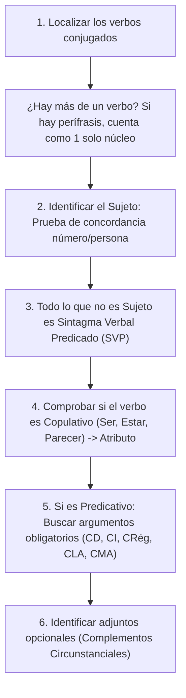

# 📖 Dossier Oficial de Lengua: Guía Maestra de Sintaxis y Comentario
**Asignatura:** Lengua Castellana y Literatura I — 1º de Bachillerato D  
**Profesora:** Ana Isabel Marín Arellano  
**Material:** Dossier Oficial de Centro (Encuadernación en espiral)  
**Estudiante:** Ángel Moreno Gutiérrez  

---

## 🎯 PARTE 1: El Algoritmo Infalible del Comentario de Texto

En el dossier de tu instituto, el departamento evalúa con una plantilla muy rigurosa. Si sigues esta estructura mecánica, te aseguras la máxima nota en cada apartado:

### 1. El Tema (¿De qué trata el texto?)
- **Regla del departamento:** Frase breve, abstracta y nominalizada (generalmente sin verbo conjugado).
- **Fórmula de redacción:**  
  *«Sustantivo abstracto + complemento especificativo»*  
  *(Ejemplos anotados en tu dossier: «La defensa de la lectura», «El doble filo del uso de las IAs como sustitutos afectivos»).*
- ❌ **Error típico:** Contar el argumento o poner una frase larga con opinión personal.

### 2. La Tesis (¿Qué postura defiende el autor?)
- **Regla del departamento:** Una **oración completa** (con sujeto y predicado claros), afirmativa o negativa, que resuma la postura explícita o implícita del autor.
- **Estructura según posición:**
  - **Analizante (Deductiva):** La tesis aparece al principio (párrafo 1) y luego se argumenta.
  - **Sintetizante (Inductiva):** Los argumentos van primero y la tesis como conclusión al final.
  - **Encuadrada / Circular:** Aparece al inicio y se reformula como conclusión al final.
  - **Repetitiva / Paralela:** Se reitera a lo largo de todo el texto.

### 3. Las Funciones del Lenguaje (Roman Jakobson) y sus Marcas
| Función | Elemento de la Comunicación | Objetivo | Marcas Lingüísticas en el Texto |
| :--- | :---: | :--- | :--- |
| **Representativa / Referencial** | Contexto / Realidad | Transmitir datos objetivos | Modo indicativo, 3ª persona, oraciones enunciativas, léxico denotativo, tecnicismos. |
| **Expresiva / Emotiva** | Emisor | Expresar subjetividad, emociones u opinión | 1ª persona (*yo/nosotros*), adjetivos valorativos, sufijos apreciativos, modo subjuntivo, exclamaciones. |
| **Apelativa / Conativa** | Receptor | Convencer, persuadir o influir | 2ª persona, imperativos, vocativos, preguntas retóricas, perífrasis de obligación (*debe, hay que*). |
| **Poética / Estética** | Mensaje | Belleza o estilo formal | Figuras retóricas (metáforas, hipérboles, antítesis, paralelismos, ironía). |
| **Metalingüística** | Código | Explicar la propia lengua | Términos gramaticales, entrecomillados para definir palabras. |
| **Fática / De contacto** | Canal | Abrir, mantener o cerrar el canal | Fórmulas de saludo/despedida, muletillas (*¿verdad?, oye, mire*). |

---

## 🔬 PARTE 2: Algoritmo de Análisis Sintáctico (Paso a Paso)

Para no perderte nunca analizando una oración del dossier:

### Funciones Clave Exigidas por tu Profesora (Nueva Gramática RAE):
1. **Complemento de Régimen (CRég):** Sintagma preposicional exigido por el verbo (*confiar en, acordarse de, aspirar a*). Si quitas la preposición, la oración queda incompleta o cambia de sentido.
2. **Complemento Locativo Argumental (CLA):** Indica lugar pero es **exigido obligatoriamente** por el verbo (*residir en Madrid, poner el libro en la mesa*). No se puede suprimir.
3. **Complemento de Medida Argumental (CMA):** Expresa peso, duración, precio o medida exigido por el verbo (*El examen dura dos horas*, *El libro cuesta 20 euros*).
4. **Complemento Predicativo (CPred):** Concuerda en género y número con el Sujeto o con el CD a través de un verbo predicativo (*Los alumnos salieron cansados*, *Compró la fruta madura*).

---

## ⚡ Los 7 Valores del Pronombre 'SE' (Chuleta de Examen)

| Valor del 'SE' | ¿Tiene función sintáctica? | Pista / Prueba de Detección | Ejemplo |
| :--- | :---: | :--- | :--- |
| **Variante de LE / LES** | **Sí (CI)** | Va delante de *lo/la/los/las* en lugar de *le*. | *Se lo dije ayer.* |
| **Reflexivo** | **Sí (CD o CI)** | El sujeto hace y recibe la acción (*a sí mismo*). | *Ángel se peina (CD).* / *Se lava las manos (CI).* |
| **Recíproco** | **Sí (CD o CI)** | Dos o más sujetos intercambian la acción (*mutuamente*). | *Ellos se escriben cartas (CI).* |
| **Morfema Pronominal** | **No** (forma parte del verbo) | El verbo exige el pronombre (*arrepentirse, quejarse*). | *Se queja de todo.* |
| **Voz Media** | **No** | Proceso espontáneo que ocurre sin agente voluntario. | *La puerta se abrió con el viento.* |
| **Pasiva Refleja** | **No** (marca de pasiva) | Sujeto paciente inanimado + verbo en 3ª pers. Concordancia. | *Se venden pisos baratos.* |
| **Impersonal Refleja** | **No** (marca impersonal) | Verbo en 3ª del singular, no hay sujeto posible. | *Se vive bien aquí.* |
