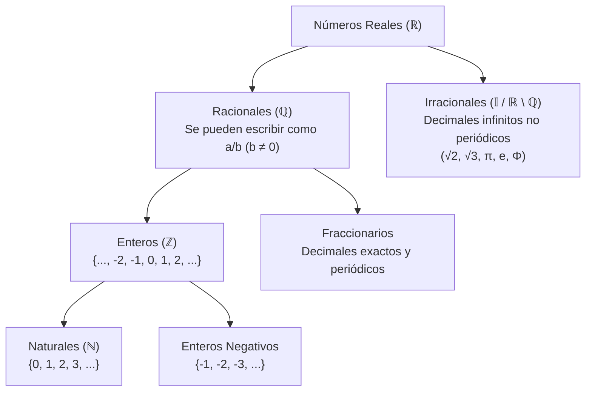

# 📐 Tema 1: Números Reales (Apuntes Limpios)
**Asignatura:** Matemáticas I — 1º de Bachillerato  
**Profesora:** Miriam Jarauta Baigorri  
**Libro de referencia:** Anaya (Operación Mundo) — Pág. 36-39  

---

## 1. Clasificación de los Conjuntos Numéricos

El conjunto de los números reales se estructura de forma jerárquica:

$$\mathbb{N} \subset \mathbb{Z} \subset \mathbb{Q} \subset \mathbb{R}$$

- **Naturales ($\mathbb{N}$):** Números para contar: $\{0, 1, 2, 3, \dots\}$.
- **Enteros ($\mathbb{Z}$):** Positivos, negativos y el cero: $\{\dots, -2, -1, 0, 1, 2, \dots\}$.
- **Racionales ($\mathbb{Q}$):** Todo número que puede expresarse como fracción de dos enteros $\frac{a}{b}$ con $b \neq 0$. Incluye enteros, decimales exactos y decimales periódicos (puros y mixtos).
- **Irracionales ($\mathbb{I}$):** Números decimales infinitos no periódicos (ejemplos: $\sqrt{2}, \sqrt{3}, \pi, e$). No se pueden poner en forma de fracción.
- **Reales ($\mathbb{R}$):** La unión de todos los racionales e irracionales: $\mathbb{R} = \mathbb{Q} \cup \mathbb{I}$.

---

## 2. Subconjuntos en la Recta Real: Intervalos y Semirrectas

Un intervalo representa el conjunto de todos los números reales comprendidos entre dos extremos $a$ y $b$.

### A. Intervalos Acotados
| Nombre | Notación | Definición Algebraica | Representación Gráfica |
| :--- | :---: | :---: | :---: |
| **Abierto** | $(a, b)$ | $\{ x \in \mathbb{R} \mid a < x < b \}$ | Extremos huecos $\circ \dots \circ$ |
| **Cerrado** | $[a, b]$ | $\{ x \in \mathbb{R} \mid a \le x \le b \}$ | Extremos rellenos $\bullet \dots \bullet$ |
| **Semiabierto por la izquierda** | $(a, b]$ | $\{ x \in \mathbb{R} \mid a < x \le b \}$ | Extremo $a$ hueco, $b$ relleno |
| **Semiabierto por la derecha** | $[a, b)$ | $\{ x \in \mathbb{R} \mid a \le x < b \}$ | Extremo $a$ relleno, $b$ hueco |

### B. Semirrectas (Intervalos No Acotados)
| Notación | Definición Algebraica | Sentido |
| :---: | :---: | :---: |
| $[a, +\infty)$ | $\{ x \in \mathbb{R} \mid x \ge a \}$ | Hacia la derecha (incluye $a$) |
| $(a, +\infty)$ | $\{ x \in \mathbb{R} \mid x > a \}$ | Hacia la derecha (no incluye $a$) |
| $(-\infty, a]$ | $\{ x \in \mathbb{R} \mid x \le a \}$ | Hacia la izquierda (incluye $a$) |
| $(-\infty, a)$ | $\{ x \in \mathbb{R} \mid x < a \}$ | Hacia la izquierda (no incluye $a$) |

---

## 3. Operaciones con Subconjuntos de $\mathbb{R}$

Sean $A$ y $B$ dos subconjuntos de la recta real:

### 1. Unión ($A \cup B$)
Elementos que pertenecen a $A$, a $B$ o a ambos a la vez:
$$A \cup B = \{ x \in \mathbb{R} \mid x \in A \text{ o } x \in B \}$$
- *Ejemplo del cuaderno:*  
  $$(-3, 1] \cup [1, 5) = (-3, 5)$$

### 2. Intersección ($A \cap B$)
Elementos que tienen en común ambos conjuntos simultáneamente:
$$A \cap B = \{ x \in \mathbb{R} \mid x \in A \text{ y } x \in B \}$$
- *Ejemplo del cuaderno:*  
  $$(-3, 2] \cap [1, 5) = [1, 2]$$

### 3. Diferencia ($A - B$)
Elementos que pertenecen al conjunto $A$ pero **no** pertenecen a $B$:
$$A - B = \{ x \in \mathbb{R} \mid x \in A \text{ y } x \notin B \}$$
- *Ejemplo del cuaderno:*  
  $$(-3, 1] - [1, 5) = (-3, 1)$$  
  *(Como el número $1$ pertenece a $B$, se excluye de la diferencia, quedando abierto en $1$)*.

### 4. Complementario ($\overline{A}$ o $A^c$)
Elementos del conjunto universal ($\mathbb{R}$) que no pertenecen a $A$:
$$\overline{A} = \mathbb{R} - A$$
- *Ejemplos del cuaderno:*  
  $$\overline{(-3, 1]} = (-\infty, -3] \cup (1, +\infty)$$  
  $$\overline{[1, 5)} = (-\infty, 1) \cup [5, +\infty)$$

> [!IMPORTANT]
> **Regla de oro para complementarios:**
> Si un extremo estaba cerrado en $A$ (con corchete), queda abierto en su complementario (con paréntesis), y viceversa.

---

## 4. Valor Absoluto y Distancias

El valor absoluto $|x|$ representa la distancia geométrica desde $x$ hasta el origen $0$ en la recta real:

$$|x| = \begin{cases} x & \text{si } x \ge 0 \\ -x & \text{si } x < 0 \end{cases}$$

### Propiedades Clave para Resolver Inecuaciones:
1. **$|x| \le k \iff -k \le x \le k \iff x \in [-k, k]$** (Intervalo cerrado acotado)
2. **$|x| < k \iff -k < x < k \iff x \in (-k, k)$** (Intervalo abierto acotado)
3. **$|x| \ge k \iff x \ge k \text{ o } x \le -k \iff x \in (-\infty, -k] \cup [k, +\infty)$** (Dos semirrectas)
4. **$|x| > k \iff x > k \text{ o } x < -k \iff x \in (-\infty, -k) \cup (k, +\infty)$**

---

## 5. Potencias de Exponente Entero y Racional

### Propiedades Fundamentales:
1. $a^n \cdot a^m = a^{n+m}$
2. $\frac{a^n}{a^m} = a^{n-m}$
3. $(a^n)^m = a^{n \cdot m}$
4. $(a \cdot b)^n = a^n \cdot b^n$
5. $\left(\frac{a}{b}\right)^n = \frac{a^n}{b^n}$
6. $a^0 = 1 \quad (\forall a \neq 0)$
7. $a^{-n} = \frac{1}{a^n} \quad \text{y} \quad \left(\frac{a}{b}\right)^{-n} = \left(\frac{b}{a}\right)^n$
8. $a^{m/n} = \sqrt[n]{a^m}$

---

## 6. Radicales (Definición, Signos y Propiedades)

### A. Definición Formal de Raíz $n$-ésima
Llamamos raíz $n$-ésima de un número real $a$ a un número real $b$ tal que:

$$\sqrt[n]{a} = b \iff b^n = a$$

- **$n$:** Índice del radical ($n \in \mathbb{N}, n \ge 2$).
- **$a$:** Radicando.
- **$b$:** Raíz.

### B. Existencia y Número de Raíces Reales

| Signo del Radicando ($a$) | Paridad del Índice ($n$) | Número de Raíces Reales | Ejemplo |
| :---: | :---: | :---: | :--- |
| **$a > 0$** | **Par** | **Dos raíces opuestas ($\pm$)** | $\sqrt{9} = \pm 3$ porque $(+3)^2 = 9$ y $(-3)^2 = 9$ |
| **$a > 0$** | **Impar** | **Una única raíz positiva** | $\sqrt[3]{8} = 2$ |
| **$a < 0$** | **Par** | **Ninguna raíz real ($\nexists \text{ en } \mathbb{R}$)** | $\sqrt{-4} \notin \mathbb{R}$ (da lugar a los imaginarios $\mathbb{C}$) |
| **$a < 0$** | **Impar** | **Una única raíz negativa** | $\sqrt[3]{-8} = -2$ porque $(-2)^3 = -8$ |
| **$a = 0$** | Cualquiera | **Una única raíz ($0$)** | $\sqrt[n]{0} = 0$ |

### C. Forma Exponencial de un Radical
$$\sqrt[n]{a^m} = a^{\frac{m}{n}}$$
- *Ejemplo del cuaderno:* $\sqrt[5]{7^3} = 7^{3/5}$

### D. Simplificación de Radicales (Paso a Paso)
1. **Factorizar** en factores primos todo el radicando.
2. **Dividir** el índice y todos los exponentes del radicando por su **m.c.d.** (máximo común divisor).
- *Ejemplos copiados en clase:*
  - a) $\sqrt[4]{9} = \sqrt[4]{3^2} = 3^{\frac{2}{4}} = 3^{\frac{1}{2}} = \sqrt{3}$ *(dividido entre 2)*
  - b) $\sqrt[4]{25 a^6} = \sqrt[4]{5^2 a^6} = \sqrt{5 a^3}$ *(dividido entre 2)*
  - c) $\sqrt[10]{\frac{32}{x^8}} = \sqrt[10]{\frac{2^5}{x^8}}$ *(aquí 10, 5 y 8 no comparten divisor común para todos; se puede expresar en potencias fraccionarias o como $\frac{2^{1/2}}{x^{4/5}} = \frac{\sqrt{2}}{\sqrt[5]{x^4}}$)*.

### E. Reducción de Radicales a Índice Común
Permite comparar radicales y multiplicarlos o dividirlos aunque tengan diferente índice:
1. Calcular el **m.c.m.** de los índices.
2. Dividir ese m.c.m. entre cada índice original y **multiplicar** el exponente del radicando por el cociente obtenido.
- *Ejemplo copiado en clase:*
  Reducir a índice común: $\sqrt[3]{5^4}$, $\sqrt[4]{7^5}$, $\sqrt{3^5}$
  - Índices: $3, 4, 2 \implies \text{m.c.m.}(3, 4, 2) = 12$
  - Primer radical: $12 / 3 = 4 \implies \sqrt[12]{5^{4 \cdot 4}} = \sqrt[12]{5^{16}}$
  - Segundo radical: $12 / 4 = 3 \implies \sqrt[12]{7^{5 \cdot 3}} = \sqrt[12]{7^{15}}$
  - Tercer radical: $12 / 2 = 6 \implies \sqrt[12]{3^{5 \cdot 6}} = \sqrt[12]{3^{30}}$
$
